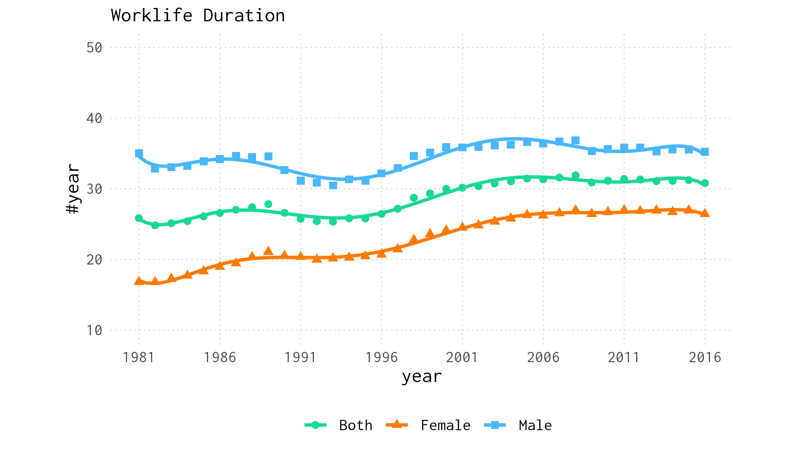
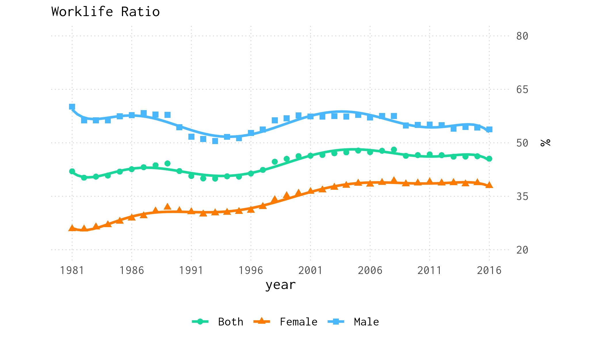
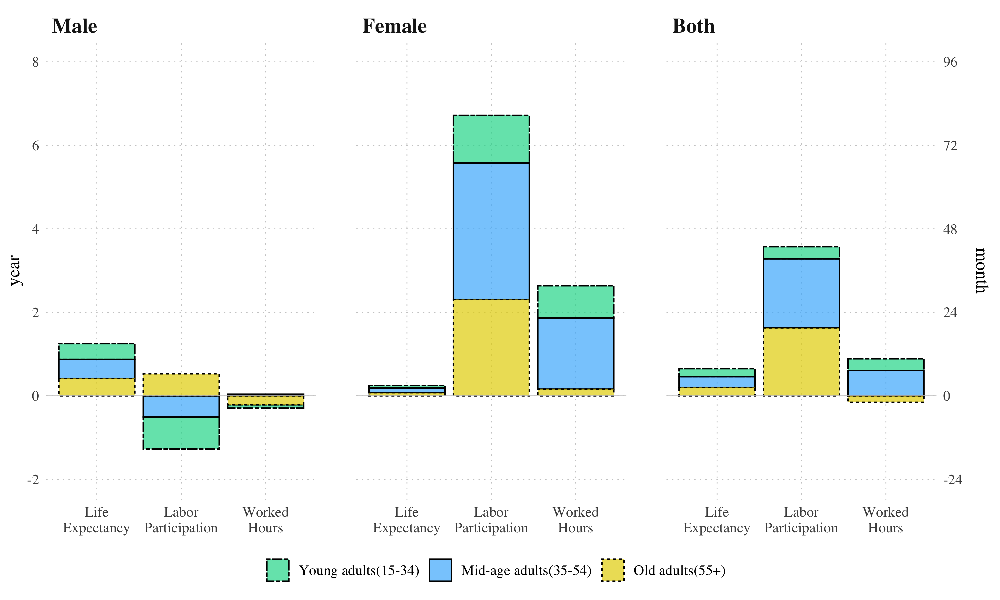

Could there be more fear of Population Aging than it causes harm?
===========

## Introduction

Population Aging is probably the most significant demographic change that most countries will experience in the decades to come.
At first glance, one may be concerned that older Canadians spend more of that time in retirement than working, posing a challenge for the funding of social programs and the retirement income system. 

However, a close look at the change in individual behaviour over recent decades shows otherwise, suggesting that the increase in labour force participation and delayed transition to retirement may help mitigate any funding gap created by longer life spans.
But trends in Work Life duration between 1981 and 2016 show that the average Work Life duration has increased by nearly five years over that period and the growth has been at a faster rate than that of life expectancy.

The following is a summary of a more extended article titled “Population Aging and Work Life Duration in Canada”. This article is published in a special issue of the Canadian Public Policy Journal.  The full text is available at https://doi.org/10.3138/cpp.2022-048. Feel free to share and reference.

## Work Life Duration
Work Life Duration is Life Expectancy at Work that accounts for labour participation and worked hours on top mortality variables. The estimation is based on an adaptation of Sulivan’s method. It consists of first creating the life table and then multiplying the number of years lived between two consecutive ages by corresponding participation rates and average worked hours.

Work Life Duration at 15 is then calculated similarly to Life Expectancy, assuming a full working year is equivalent to 2000 hours, i.e. 40 hours for 50 weeks.

*Trend in Work Life Duration at age 15 for men, women and both sexes, between 1981 and 2016*

Work Life Duration for both sexes combined increased by 4.96 years from 25.9 years in 1981 to 30.8 years in 2016. And this despite the slowing down during the 90s. If we look further at the trend for men and women, It appears that Work Life Duration increased for women by 9.6 years, from 16.8 years in 1981 to 26.4 years in 2016. The slowing down was more severe among men for whom Work Life Duration reached its lowest level during the 90s. As a result,  Work Life Duration in 2016 just recovered about the same level in 1981, with only 0.25 year increase.

## Work Life Ratio
While total Work Life Duration has increased over the last four decades, Life Expectancy also has increased. Therefore, the Work Life Ratio compares the two measures and provides an overview of the changes in individual behaviours. 

*Trend in Work Life Ratio at age 15 for men, women and both sexes, between 1981 and 2016*

In 1981, men aged 15 years old would expect to devote about 60.1\% of their lives to paid work. By 2016 that proportion fell to about 53.8\%, a decrease of 6.38 points. On the other hand, women have increased their Work Life Ratio by 12 points, from 25.9\% in 1981 to 37.9\% in 2016. This increase is partially due to a lesser gain in mortality for women who gain only 3.83 years in life expectancy against 7.37 years for men.

Over the past few decades, not only has total WLD increased, but its ratio to Life Expectancy also increased between 1981 and 2016. Still, how much Population Ageing contributed to the changes remains a question. For answering this question, the model of continuous change \citep{Horiuchi:2008cn} is used to decompose the difference between the additional Work Life Duration between 1981 and 2016 into demographic and behavioural components. 

*Number of years contributed by components to changes in Work Life duration by sexe in Canada between 1981 and 2016*

Results show that labour participation has been the main driver of the changes in Work Life Duration, contributing 3.57 years, against 0.73 and 0.65 years for worked hours and mortality, respectively. The dominance of participation is expected, especially for women. However, while of the three components, longevity contributes the least to Work Life Duration for both sexes combined, it is the only one with a positive contribution of 1.25 years for men. As a result, although small, the effect of Population ageing on Work Life duration is positive. Interestingly, Labour participation at older ages made a significant contribution to the increase in Work Life Duration. Almost as much as adults of prime ages and about ten times that of the young adults. 

## Conclusion
In summary, Canadians have worked long enough to cover their increased longevity, and this trend will likely persist for the next few decades.
Therefore, a policy to increase the normal retirement age based on shrinking Work Life duration appears neither necessary nor urgent.
What would be needed are policies that promote, support, and enhance existing trends in living and working longer.
